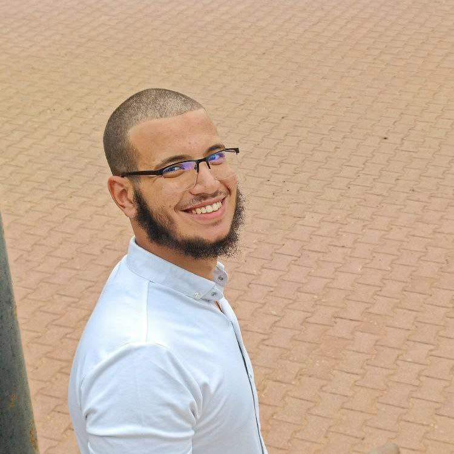

# Chabi Amine sif eddine

## 📸 About Me

  

I'm a recent Computer Science graduate from <b>Algeria</b>, passionate about building reliable backend systems, learning through open-source collaboration, and continuously evolving as a software engineer.

I specialize in <b>Java-based development</b> and enjoy turning ideas into software solutions that are scalable and developer-friendly.

  

 

## 💻 What I Do

- **Backend Development**: RESTful APIs, Spring Boot, and Java-based microservices.
- **Mobile Development**: Android apps built with Java and Android Studio.
- **Desktop Apps**: Lightweight and useful tools with JavaFX.
- **Web Collaboration**: Contributing with HTML, CSS, and JavaScript.
- **Teaching & Open Source**: Taught a Git workshop, preparing for MLH Fellowship and GSoC.

---

## 🚀 Currently Working On

- Polishing and documenting my key projects
- Exploring cloud-native development with Spring Boot
- Contributing to open source Java projects
- Practicing clean architecture and testing
- Preparing for internships and backend roles

---

## 📫 Let’s Connect

Looking to collaborate, learn, or share knowledge? Feel free to [reach out]() or connect with me on:

- [GitHub](https://github.com/yourusername)
- [LinkedIn](https://linkedin.com/in/yourprofile)
- Email: `yourname@example.com`

---

> \_“I'm not just building projects, I'm building my future as a software engineer who empowers others.”
