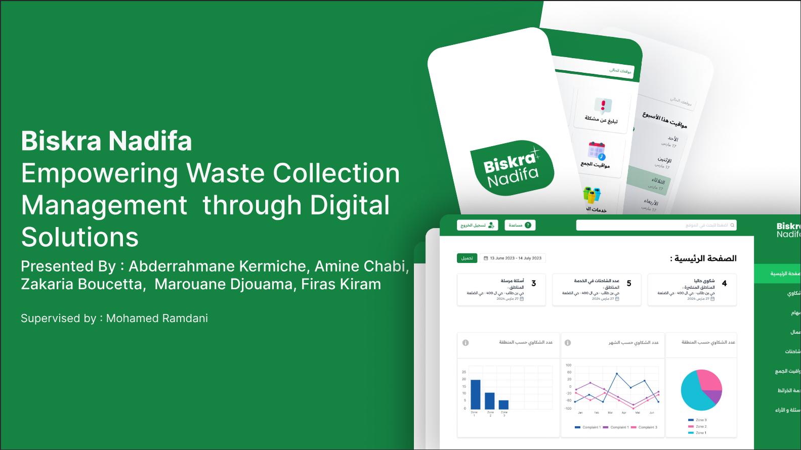
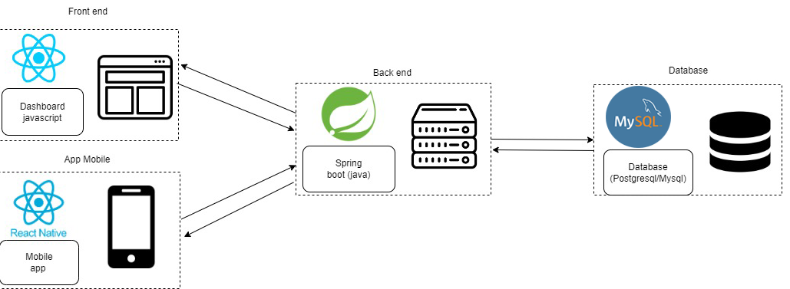
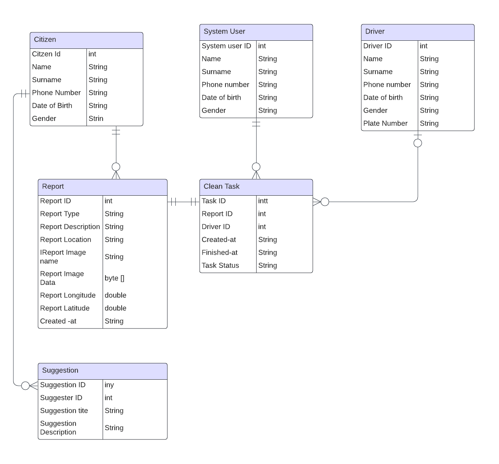
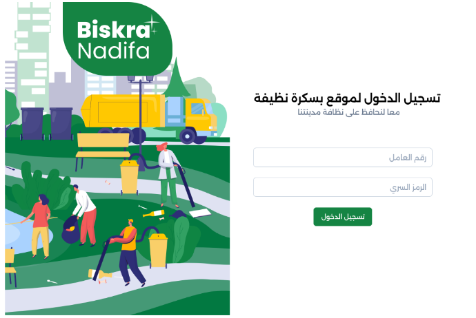
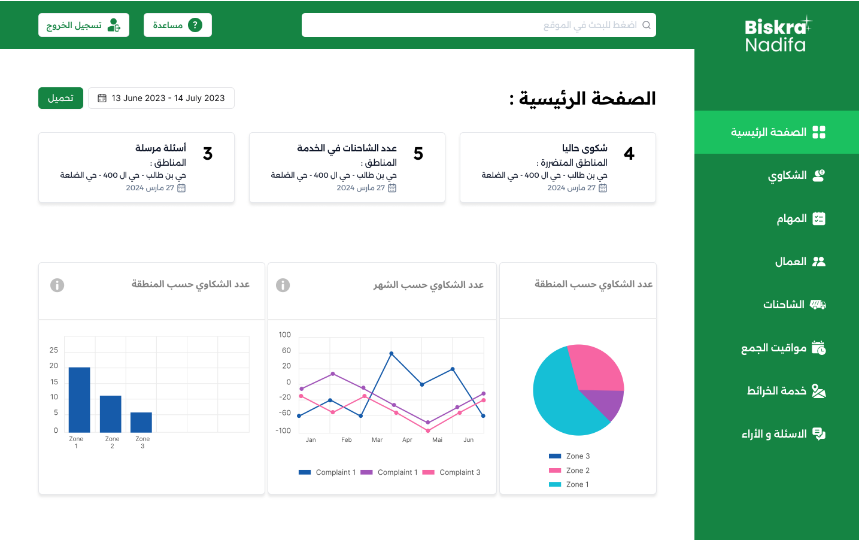
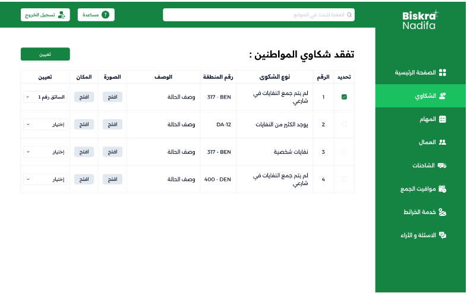
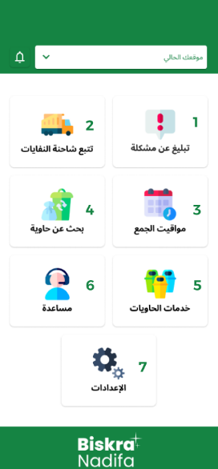
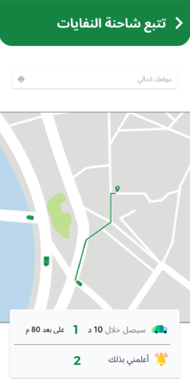
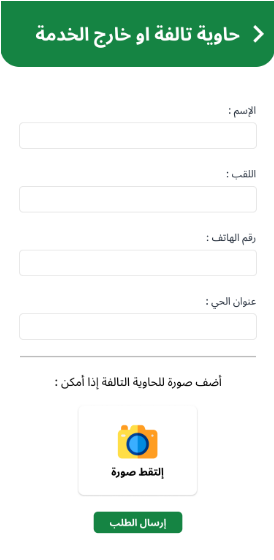

# ♻️ Biskra Nadifa – Smart Waste Management System for Biskra


## 🔍 Overview


**Biskra Nadifa** (Arabic: "A Clean Biskra") is a **waste management platform** designed to address the escalating **problem of unmanaged trash in Biskra city** , Algeria. It facilitates digital coordination between citizens, cleaning agents (drivers), and system administrators to ensure responsive and efficient urban sanitation.

{loading=lazy}


This project was originally built as a **demonstrative MVP for a university graduation project**, with a **complete backend system developed using Spring Boot**.


---


github repo : ```https://github.com/Amine2000s/Biskra-nadifa-Backend-App```


## 🛠️ Tech Stack

- Java 17
- Spring Boot
- Spring Data JPA (Hibernate)
- MySQL
- Swagger (OpenAPI)
- Maven

---

## 🧠 Architecture

### 👥 Users

| Role           | Responsibilities                                                                          |
|----------------|-------------------------------------------------------------------------------------------|
| **Citizen**    | Submits trash reports (type, location, image), provides suggestions via mobile app        |
| **Driver**     | Views assigned cleanup tasks, updates task status via mobile app                          |
| **System User**| Validates reports, assigns tasks to the most appropriate driver via dashboard             |

### 🗂 Modules

- **Citizen Module**
- **Truck Driver Module**
- **System Admin Module**

---

### 🗺️ General Architecture



### 📊 ER Diagram



---

## 🎯 Key Features

| Feature                            | Description                                                                 |
|------------------------------------|-----------------------------------------------------------------------------|
| 📸 Report Submission               | Citizens submit trash location, type, and image evidence                    |
| 👤 Role-based Modules             | Modular separation of logic for each user category                          |
| 📍 Task Assignment Workflow       | System users assign tasks manually based on citizen reports                 |
| 🚚 Driver Dashboard               | Drivers view, update, and manage assigned cleanup tasks                     |
| 📝 Suggestion System              | Citizens can submit feedback and suggestions                                |
| 📅 Trash Schedule + Bins          | Bins and collection schedules viewable by all modules                       |
| 🧪 RESTful APIs + Swagger UI      | Full REST API exposed with interactive Swagger docs                         |

---

## 💡 My Role

- Led backend development of the entire system
- Designed and implemented the database model + REST API structure
- Created modular role-based access for system admin, driver, and citizen
- Delivered Swagger-based API documentation for internal and future use
- Ensured image upload handling and report validation logic

---

## 🧪 Deployment Details

- API runs on port `8083` by default
- Configurable in `application.properties`
- Future plans: Dockerize and expose through HTTPS proxy or Nginx

```properties
server.port=8083
spring.datasource.url=jdbc:mysql://localhost:3306/biskranadifa_database
spring.datasource.username=root
spring.datasource.driver-class-name=com.mysql.cj.jdbc.Driver
```

Base URL:   ```http://localhost:8083/```

Swagger UI: ```http://localhost:8083/swagger-ui/index.html#/```


## 📷 Image Gallery

## 🖼️ Biskra Nadifa – Image Gallery

Click on any image to zoom. All images are lazy-loaded for performance.


### 🖥️ Dashboard interfaces

{width=300 loading=lazy }


{ width=300 loading=lazy }


{ width=300 loading=lazy }


{ width=300 loading=lazy }

---

### 📱 Mobile Interface Screens

{ width=250 loading=lazy }

{ width=250 loading=lazy }

{ width=250 loading=lazy }

{ width=250 loading=lazy }


---

## 🔭 Future Work (Planned V2)

- Add JWT authentication + authorization per role

- Implement rate limiting and idempotency

- Add message queues (RabbitMQ or Kafka) for task creation and driver notification

- Build a driver-selection algorithm (based on distance or task load)

- Add Spring Boot Actuator + Micrometer for monitoring

- Dockerize and package the platform for deployment

- Add API pagination and image compression

- Write a technical article about API optimization