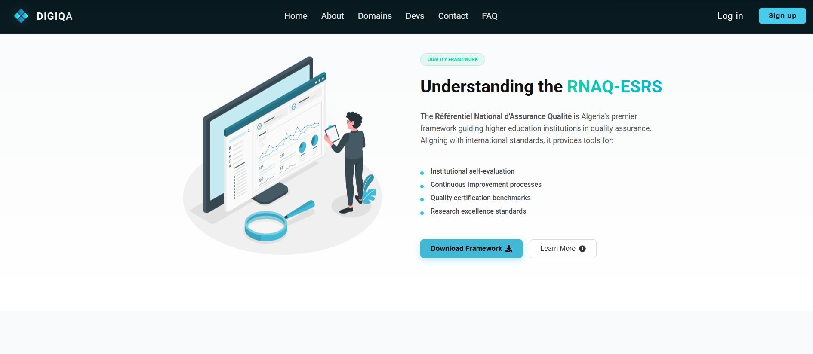
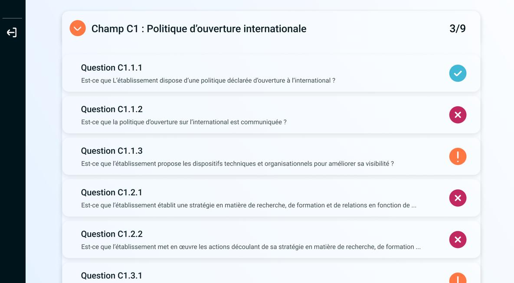
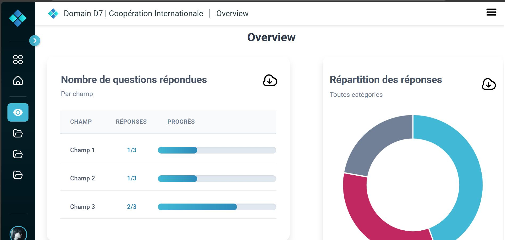
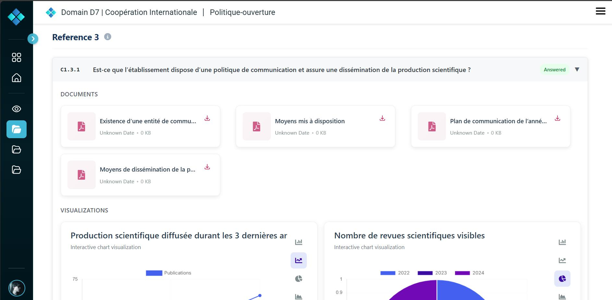
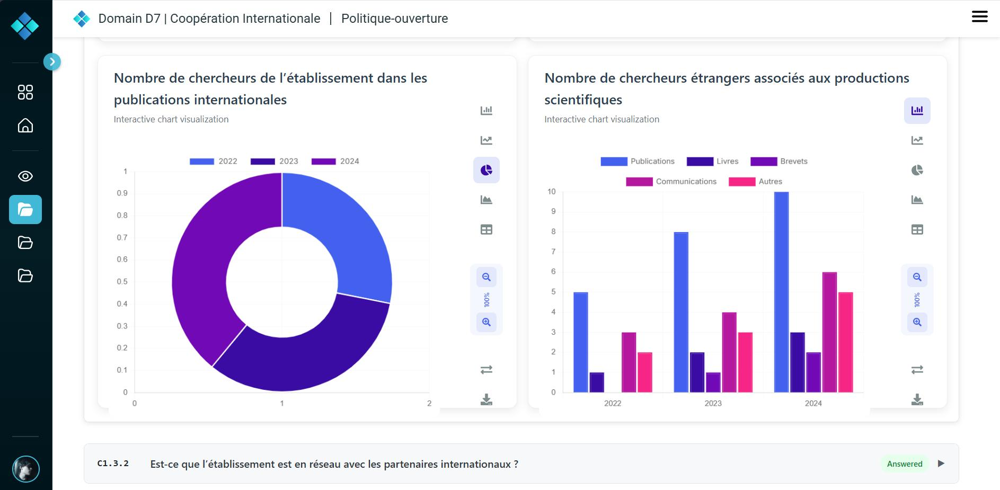
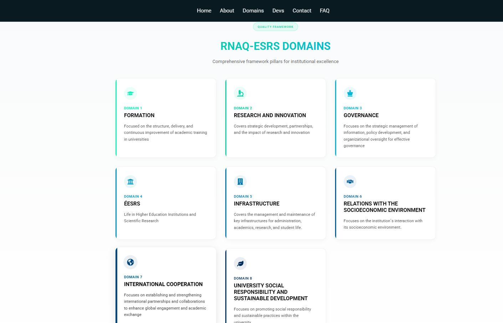

# DIGIQA – Digital Quality Assurance Platform

**DIGIQA** is a full-stack web application developed in collaboration with the **Quality Assurance Cell** at **Mohamed Khider University of Biskra**. It aims to digitize quality assurance processes aligned with **RNAQES** (Référentiel National d’Assurance Qualité de l’Enseignement Supérieur), Algeria’s national reference for quality assurance in higher education.

---

{ loading=lazy }

## 🎯 Problem & Goal

Algerian universities still rely on manual reporting and Excel files to manage quality-related data. DIGIQA offers a centralized and authenticated platform that reduces fragmentation, improves traceability, and enables structured evaluation workflows.

---

## 🛠️ Tech Stack

| Layer            | Technology                          |
|------------------|--------------------------------------|
| Backend          | Java 17, Spring Boot (MVC, Security, AOP) |
| Frontend         | **React.js** (SPA Dashboard)         |
| Database         | MySQL + JPA (Hibernate)              |
| Build Tool       | Maven                                |
| Authentication   | JWT + Email Code Verification        |
| Migrations       | Flyway                               |
| Observability    | Spring Boot Actuator + MDC Logging   |
| File Handling    | GZIP compression + dynamic download  |
| Others           | Custom Rate Limiting (AOP), HATEOAS  |

---

## 🔍 Key Features

### ✅ Evaluation Unit Management  
Manage and submit indicators, documents, and metadata aligned with RNAQES.

### 📄 GZIP File Upload  
All files are compressed server-side and downloaded on demand.

### 🔐 JWT Authentication  
Secure login/signup via JWT tokens and 2-step email verification.

### ⚖️ Rate Limiting & Throttling  
Implemented via Spring AOP for specific endpoints and IP throttling.

### 📎 HATEOAS-Style Hypermedia JSON  
REST APIs return navigable links, making the client loosely coupled.

### 📝 Asynchronous Logging with MDC  
Each request is tagged and logged in a separate file with contextual metadata.

### 📦 Database Migrations with Flyway  
All schema changes are versioned and automated

### 🗎 Swagger Based API documentation 
Delivered Swagger-based API documentation for internal and future use

---

## 🧠 Architecture Diagram

{ loading=lazy }

## 🗃️ ER Diagram

{ loading=lazy }

---

## 🖼️ Image Gallery

---

## 📦 Planned Enhancements

| Feature                     | Status       |
|-----------------------------|--------------|
| Role-Based Access Control   | 🟡 In progress |
| Docker Support              | 🟡 Planned     |
| Audit Logging               | 🟡 Planned     |
| Micrometer Integration      | 🟡 Planned     |
| Global Exception Handling   | 🟡 Planned     |
| Nginx + VPS Deployment      | ⚪ Planned     |

---

***The repository is currenlty private due to some agreements with the university , i will provide a more comprehensive gist page soon***
