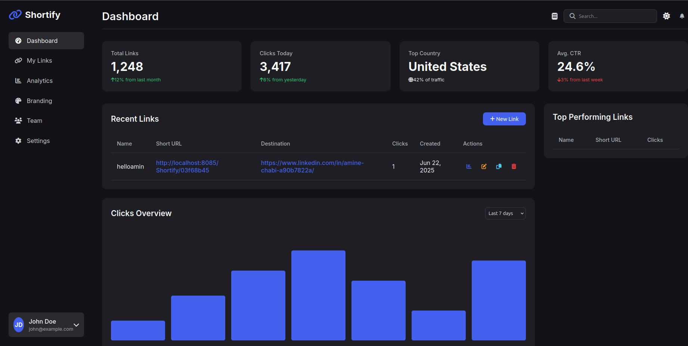
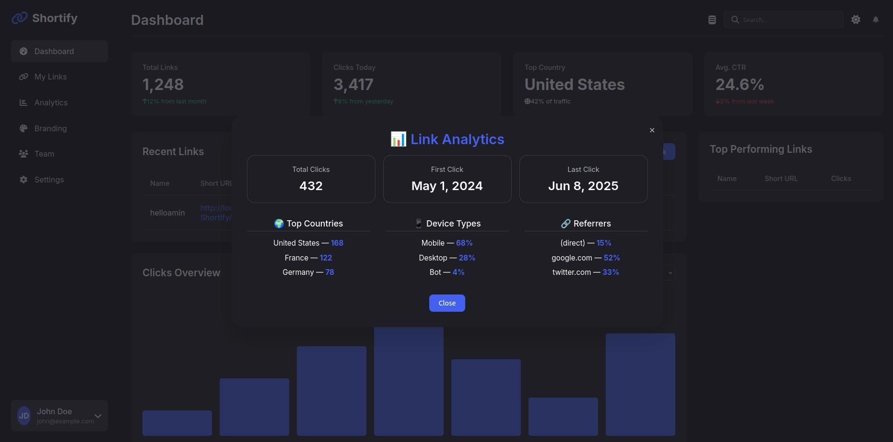

# Shortify – Custom URL Shortener with Visit Analytics

**Shortify** is a work-in-progress URL shortener built using **Spring MVC** and **Thymeleaf**, designed to go beyond simple redirection by capturing meaningful visit analytics. The application demonstrates backend craftsmanship, modular design, and real-world deployment readiness.

{loading=lazy}


---

### Github repo : https://github.com/Amine2000s/Shortify-URL-Shortner

## 🚧 Project Status

This is an actively developed project. The MVP is functional, and new capabilities are being added iteratively, including authentication, Dockerization, and more sophisticated analytics.

---

## 🔧 Tech Stack

- Java 17
- Spring Boot (MVC, Validation, Web, Data JPA)
- Thymeleaf
- MySQL 
- Lombok
- Device detection via User-Agent
- IP-based GeoIP (basic lookup)

---

## ✅ Implemented Features

- 🔗 Shorten long URLs via a simple UI
- 📋 Dashboard-style feedback with Thymeleaf modals
- 📊 Analytics:
  - Time of visit
  - Device type
  - Visitor country (basic GeoIP)
- ✂️ Copy-to-clipboard for short URLs
- 📁 Custom hash-based short link generation (see below)

---

## 🔐 Authentication (Done)

Authentication will be added using **session-based login** via Spring Security, instead of stateless JWT. This aligns better with Thymeleaf and server-side rendered workflows.

---

## 🐳 Docker (on going)

The app will be Dockerized to support deployment via containers and integrated into a CI/CD pipeline. MySQL will run in a separate container.

---

## 📊 Analytics Panel (1/2 on going)

A new statistics dashboard will provide:

- Charts (visits over time, device split)(done)
- Filters by date, device, and country (on going)

---

## ✨ Link Generation Strategy

Shortify uses a **deterministic hash-based strategy** to create unique short links.

### 🔑 Inputs:
- User identifier (e.g., username or session token)
- Domain of the original URL
- Timestamp of the shortening request

These are combined, hashed (e.g., SHA-256), then encoded (e.g., base62) into a short code:

```text
Inputs:
 - Username: amine2000
 - URL: https://example.com/blog/post-123
 - Time: 2025-06-20T14:12:35Z

→ Base String:
   amine2000-example.com-20250620141235
→ SHA-256 + Base62
→ Code: BskX9a

→ Resulting URL:
   https://shortify.dev/BskX9a

This ensures:

- Unique links for each user + URL + time combo

- Non-sequential, hard-to-guess codes

- Avoidance of UUIDs or ID leaks
```

🔄 How to Run Locally

```Bash
git clone https://github.com/Amine2000s/Shortify-URL-Shortner.git
cd Shortify-URL-Shortner
./mvnw spring-boot:run

Then open: http://localhost:8085/Dashboard or http://localhost:8085/Home
```

---
## 📦 Feature Roadmap

| Feature                   | Status     | Notes                                    |
| ------------------------- | ---------- | ---------------------------------------- |
| Authentication (Sessions) | 🟢 Done | Simpler and better for Thymeleaf apps    |
| Docker support            | 🟠 on Going | MySQL + app containerization             |
| Analytics panel w/ charts | 1/2  on Going | Charts.js or similar with device filters |
| Redis caching             | ⚪ Optional | For performance at scale                 |
| Nginx + VPS deployment    | ⚪ Planned  | For production deployment                |


## 📷 Image Gallery

{loading=lazy}
{loading=lazy}
